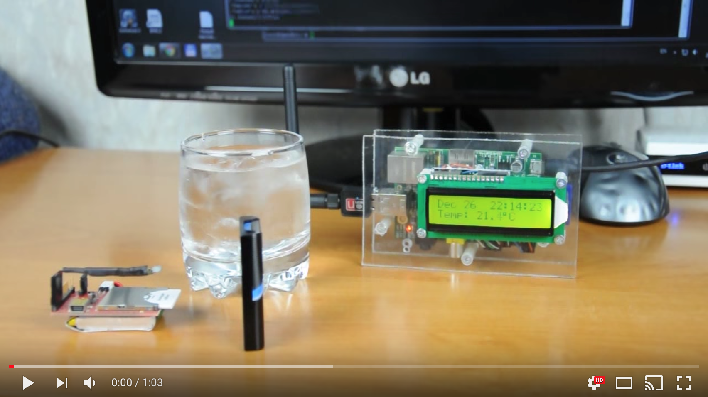

# temperature-sensor

Electric imp + raspberry pi temperature sensor

## Installation
`app-engine/` - Scripts for Google App Engine. Server side for collecting and storing data.

`imp/` - Electric Imp Code.

`raspberry/` - Python code for Raspberry Pi. 

Just copy all code to the targets.

## More

Description in Russian: https://geektimes.ru/post/257698/

## Licence
Licensed under the MIT license.
